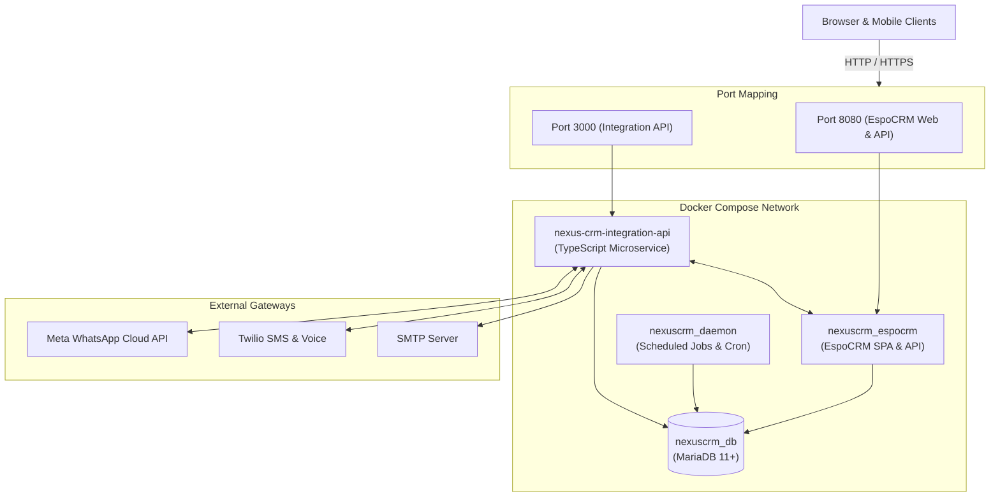

# NexusCRM

[](LICENSE)
[](docker-compose.yml)
[](integration-api/package.json)
[](integration-api/tsconfig.json)
[](docker-compose.yml)

**NexusCRM** is an enterprise-grade omnichannel Customer Relationship Management platform. It combines the power of **EspoCRM** with a dedicated **TypeScript Integration API** microservice to orchestrate real-time interactions across **WhatsApp Cloud API**, **Twilio SMS & Voice**, and **SMTP Email**, backed by a tuned **MariaDB** database with granular volume persistence.

---

## Key Capabilities

- **Omnichannel Communication Engine**: Native bidirectional pipelines for WhatsApp Cloud API, Twilio SMS/Voice, and transactional email.
- **Unified Conversation Timeline**: Ingests incoming multi-channel messages and maps them automatically to corresponding Leads and Contacts.
- **Enterprise-Grade Security**:
  - **Zero-Trust Backend**: 100% server-side validation and authorization.
  - **BOLA Protection**: Rigorous object-level authorization across all record endpoints.
  - **SQL Injection Defense**: Strictly parameterized queries and prepared statements.
  - **Secure Session Isolation**: Cryptographic HTTP-only session cookies.
  - **Secrets Isolation**: Complete decoupling via environment variables (`process.env`).
- **Resilient Container Architecture**: Docker Compose stack featuring automated InnoDB database health checks and an independent background task worker (`espocrm-daemon`).
- **Zero-Loss Persistence**: Granular named volume partitioning (`espocrm_db`, `espocrm_data`, `espocrm_custom`, `espocrm_custom_client`).

---

## Architecture Overview



---

## Repository Structure

```
nexuscrm/
├── .agents/                        # AI agent & pair programmer configuration
│   └── rules/
│       ├── documentation.md       # Documentation standards and freshness rules
│       └── performance.md         # MariaDB, container, and API performance rules
├── .env.example                   # Master environment variables template
├── .gitignore                     # Git ignore rules for node, volumes, and secrets
├── AGENTS.md                      # Workspace agent governance and security rules
├── README.md                      # Repository overview and documentation hub
├── docker-compose.yml             # Container orchestration (MariaDB, EspoCRM, Daemon)
├── docs/                          # In-depth technical documentation
│   ├── architecture.md            # System topology, sequence flows, network isolation
│   ├── crm-comparison.md          # Technical analysis of open-source CRM platforms
│   ├── deployment.md              # Production deployment, backups, and SSL hardening
│   ├── integrations.md            # WhatsApp, Twilio, SMTP, and EspoCRM webhooks
│   └── rbac.md                    # Role hierarchy, permissions matrix, and BOLA defense
├── espocrm/
│   └── custom/                    # Custom EspoCRM backend PHP modules and entities
├── integration-api/               # Omnichannel Integration Microservice
│   ├── Dockerfile                 # Container definition for integration service
│   ├── package.json               # Node.js dependencies and build scripts
│   ├── tsconfig.json              # TypeScript configuration
│   └── src/                       # Microservice source code
│       ├── config/                # Environment configuration loader
│       ├── email/                 # SMTP transactional mail dispatcher
│       ├── espocrm/               # EspoCRM API client and webhook listener
│       ├── storage/               # File attachments and database connection
│       ├── timeline/              # Unified activity timeline aggregator
│       ├── twilio/                # Twilio SMS and voice webhooks
│       └── whatsapp/              # WhatsApp Cloud API handlers
└── scripts/
    ├── healthcheck.sh             # Bash service health verification script
    └── seed.js                    # Database metadata and role seeding script
```

---

## Quickstart Guide

### 1. Prerequisites
- [Docker Engine](https://docs.docker.com/engine/install/) 24.0+ and [Docker Compose](https://docs.docker.com/compose/) v2+
- [Node.js](https://nodejs.org/) 18 LTS+ (only required if developing the integration API locally)

### 2. Configure Environment Variables
Copy `.env.example` to `.env` and fill in your secrets:
```bash
cp .env.example .env
```

### 3. Launch the Stack
Start the database and CRM containers:
```bash
docker compose up -d
```

### 4. Verify System Health
Execute the automated health check script:
```bash
chmod +x scripts/healthcheck.sh
./scripts/healthcheck.sh
```
Or check container states:
```bash
docker compose ps
```

### 5. Access NexusCRM
Open your browser and navigate to:
```
http://localhost:8080
```
Log in using the administrator credentials configured in your `.env` file.

---

## Available Services & Ports

| Service | Container Name | Port Mapping | Description |
| :--- | :--- | :--- | :--- |
| **EspoCRM Web** | `nexuscrm_espocrm` | `8080:80` | Web UI and core REST API |
| **MariaDB** | `nexuscrm_db` | Internal `3306` | Persistent relational database |
| **Espo Daemon** | `nexuscrm_daemon` | N/A (Internal) | Background task scheduler and queue worker |
| **MinIO Storage** | `nexuscrm_minio` | `9000:9000`, `9001:9001` | S3-compatible object storage & console |
| **Integration API**| `nexus-crm-integration-api` | `3000:3000` | Omnichannel communication microservice |

---

## Comprehensive Technical Documentation

Explore the detailed architecture and implementation manuals:

- 📐 **[System Architecture](docs/architecture.md)** — Topology diagrams, container networks, data flows, and persistence.
- ⚖️ **[CRM Platform Comparison](docs/crm-comparison.md)** — Trade-off analysis comparing EspoCRM, SuiteCRM, Odoo, and custom builds.
- 🚀 **[Production Deployment Guide](docs/deployment.md)** — Host configuration, backups, SSL reverse proxy setup, and operational runbooks.
- 🔌 **[Third-Party Integrations Guide](docs/integrations.md)** — WhatsApp Cloud API, Twilio SMS/Voice, SMTP, and EspoCRM webhooks.
- 🛡️ **[RBAC & BOLA Defense Specification](docs/rbac.md)** — Role hierarchy, permissions matrix, and object-level authorization patterns.
- 📜 **[Agent Governance & Security Directives](AGENTS.md)** — Developer rules, security mandates, and architectural constraints.

---

## License

This project is licensed under the [ISC License](LICENSE).
