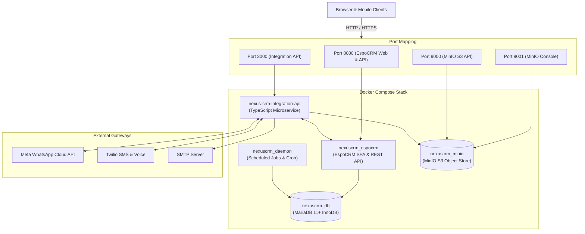

# NexusCRM

[](LICENSE)
[](docker-compose.yml)
[](integration-api/package.json)
[](integration-api/tsconfig.json)
[](docker-compose.yml)
[](docker-compose.yml)

**NexusCRM** is an enterprise-grade omnichannel Customer Relationship Management platform. It combines the power of **EspoCRM** with a dedicated **TypeScript Integration API** microservice to orchestrate real-time interactions across **WhatsApp Cloud API**, **Twilio SMS & Voice**, and **SMTP Email**, backed by a tuned **MariaDB** database, granular volume persistence, and **MinIO** S3-compatible object storage for call recordings, attachments, and documents.

---

## Key Capabilities

- **Omnichannel Communication Engine**: Native bidirectional pipelines for WhatsApp Cloud API, Twilio SMS/Voice, and transactional email via a dedicated TypeScript microservice.
- **Unified Conversation Timeline**: Ingests incoming multi-channel messages and maps them automatically to corresponding Leads and Contacts inside EspoCRM.
- **S3-Compatible Object Storage**: MinIO bucket (`crm-files`) stores call recordings, document attachments, and file uploads using AWS SDK v3.
- **5-Tier RBAC System**: Granular role hierarchy (Super Admin → Admin → Manager → Sales Executive → Support/User) with field-level and object-level authorization.
- **EspoCRM API Bridge**: Dedicated Integration API user (`nexus-integration`) with API key authentication (`X-Api-Key`) providing least-privilege CRM access.
- **Enterprise-Grade Security**:
  - **Zero-Trust Backend**: 100% server-side validation and authorization. All environment variables validated via Zod schema at runtime startup.
  - **BOLA Protection**: Rigorous object-level authorization across all record endpoints.
  - **SQL Injection Defense**: Strictly parameterized queries and prepared statements.
  - **Secure Session Isolation**: Cryptographic HTTP-only session cookies.
  - **Secrets Isolation**: Complete decoupling via environment variables (`process.env`). Zero hardcoded credentials.
- **Resilient Container Architecture**: Docker Compose stack with automated InnoDB database health checks and an independent background task worker (`espocrm-daemon`).
- **Zero-Loss Persistence**: Granular named volume partitioning for MariaDB, EspoCRM data, custom modules, and MinIO storage.

---

## Architecture Overview



---

## Repository Structure

```
nexuscrm/
├── .agents/                        # AI agent & pair programmer configuration
│   └── rules/
│       ├── documentation.md       # Documentation standards and freshness rules
│       └── performance.md         # MariaDB, container, and API performance rules
├── .env.example                   # Master environment variables template (26 variables)
├── .gitignore                     # Git ignore rules for node, volumes, and secrets
├── AGENTS.md                      # Workspace agent governance and security rules
├── README.md                      # Repository overview and documentation hub
├── docker-compose.yml             # Container orchestration (MariaDB, EspoCRM, MinIO, Daemon)
├── docs/                          # In-depth technical documentation
│   ├── architecture.md            # System topology, sequence flows, network isolation
│   ├── crm-comparison.md          # Technical analysis of open-source CRM platforms
│   ├── deployment.md              # Production deployment, backups, and SSL hardening
│   ├── integrations.md            # WhatsApp, Twilio, SMTP, and EspoCRM webhooks
│   └── rbac.md                    # Role hierarchy, permissions matrix, and BOLA defense
├── espocrm/
│   └── custom/                    # Custom EspoCRM backend PHP modules and entities
├── integration-api/               # Omnichannel Integration Microservice (TypeScript)
│   ├── Dockerfile                 # Container definition for integration service
│   ├── package.json               # Node.js dependencies and build scripts
│   ├── tsconfig.json              # TypeScript 7.x compiler configuration
│   └── src/
│       ├── config/
│       │   └── env.ts             # Zod-validated typed environment loader
│       ├── email/
│       │   └── service.ts         # SMTP transactional mail dispatcher
│       ├── espocrm/
│       │   └── client.ts          # EspoCRM REST client (X-Api-Key auth + entity helpers)
│       ├── storage/
│       │   └── minio.ts           # AWS SDK v3 S3 client for MinIO (upload, download, health)
│       ├── timeline/
│       │   └── service.ts         # Unified omnichannel event normalizer
│       ├── twilio/
│       │   ├── routes.ts          # Twilio SMS/Voice webhook Express routes
│       │   └── service.ts         # Twilio SDK client for outbound SMS
│       ├── whatsapp/
│       │   ├── routes.ts          # WhatsApp hub verification + inbound POST handler
│       │   └── service.ts         # WhatsApp Cloud API send + payload parser
│       └── server.ts              # Express app bootstrap, middleware, /health endpoint
└── scripts/
    ├── healthcheck.sh             # Bash service health verification script
    ├── seed-roles.js              # EspoCRM 5-tier RBAC role seeding script
    └── seed-api-user.js           # EspoCRM Integration API role & user provisioning script
```

---

## Quickstart Guide

### 1. Prerequisites
- [Docker Engine](https://docs.docker.com/engine/install/) 24.0+ and [Docker Compose](https://docs.docker.com/compose/) v2+
- [Node.js](https://nodejs.org/) 20 LTS+ (required for the Integration API)

### 2. Configure Environment Variables
Copy `.env.example` to `.env` and fill in your secrets:
```bash
cp .env.example .env
```

### 3. Launch the Full Stack
Start all containers (MariaDB, EspoCRM, MinIO, Daemon):
```bash
docker compose up -d
```

### 4. Provision EspoCRM Roles & API User
Seed the 5-tier RBAC roles:
```bash
node scripts/seed-roles.js
```
Create the Integration API service user and obtain an API key:
```bash
node scripts/seed-api-user.js
```
Copy the printed `ESPOCRM_API_KEY` value into your `.env` file.

### 5. Start the Integration API
```bash
cd integration-api
npm install
npm run dev       # Development (hot-reload with tsx)
# or
npm run build && npm start   # Production
```

### 6. Verify System Health
```bash
docker compose ps
curl http://localhost:3000/health
```

### 7. Access NexusCRM
| Service | URL | Credentials |
| :--- | :--- | :--- |
| **EspoCRM Web UI** | http://localhost:8080 | From `.env` admin credentials |
| **MinIO Console** | http://localhost:9001 | `MINIO_ROOT_USER` / `MINIO_ROOT_PASSWORD` |
| **Integration API** | http://localhost:3000 | API key via `X-Api-Key` header |

---

## Available Services & Ports

| Service | Container Name | Port Mapping | Description |
| :--- | :--- | :--- | :--- |
| **EspoCRM Web** | `nexuscrm_espocrm` | `8080:80` | Web UI and core REST API |
| **MariaDB** | `nexuscrm_db` | Internal `3306` | Persistent relational database (InnoDB) |
| **Espo Daemon** | `nexuscrm_daemon` | N/A (Internal) | Background task scheduler and queue worker |
| **MinIO Storage** | `nexuscrm_minio` | `9000:9000` (API), `9001:9001` (Console) | S3-compatible object storage for call recordings, attachments, and documents |
| **Integration API** | `nexus-crm-integration-api` | `3000:3000` | TypeScript omnichannel communication microservice |

---

## Environment Variables Reference

| Variable | Description | Required |
| :--- | :--- | :---: |
| `MARIADB_ROOT_PASSWORD` | MariaDB root account password | ✅ |
| `MARIADB_DATABASE` | Database name (default: `espocrm`) | ✅ |
| `MARIADB_USER` / `MARIADB_PASSWORD` | Application DB credentials | ✅ |
| `ESPOCRM_ADMIN_USERNAME` / `ESPOCRM_ADMIN_PASSWORD` | CRM admin login | ✅ |
| `ESPOCRM_SITE_URL` | Public-facing CRM URL | ✅ |
| `ESPOCRM_API_KEY` | Integration API service user key (from `seed-api-user.js`) | ✅ |
| `MINIO_ROOT_USER` / `MINIO_ROOT_PASSWORD` | MinIO root credentials | ✅ |
| `TWILIO_ACCOUNT_SID` / `TWILIO_AUTH_TOKEN` / `TWILIO_PHONE_NUMBER` | Twilio credentials | Phase 13 |
| `WHATSAPP_ACCESS_TOKEN` / `WHATSAPP_PHONE_NUMBER_ID` / `WHATSAPP_VERIFY_TOKEN` | WhatsApp Cloud API | Phase 15 |
| `SMTP_HOST` / `SMTP_PORT` / `SMTP_USER` / `SMTP_PASSWORD` | Email provider credentials | Phase 12 |

---

## Comprehensive Technical Documentation

- 📐 **[System Architecture](docs/architecture.md)** — Container topology, sequence flows, MinIO storage, and network isolation.
- ⚖️ **[CRM Platform Comparison](docs/crm-comparison.md)** — Trade-off analysis comparing EspoCRM, SuiteCRM, Odoo, and custom builds.
- 🚀 **[Production Deployment Guide](docs/deployment.md)** — Full setup procedure, backup strategies, SSL reverse proxy, and integration API startup.
- 🔌 **[Third-Party Integrations Guide](docs/integrations.md)** — WhatsApp Cloud API, Twilio SMS/Voice, SMTP, MinIO storage, and EspoCRM webhooks.
- 🛡️ **[RBAC & BOLA Defense Specification](docs/rbac.md)** — 5-tier role hierarchy, permissions matrix, Integration API role, and object-level authorization patterns.
- 📜 **[Agent Governance & Security Directives](AGENTS.md)** — Developer rules, security mandates, and architectural constraints.

---

## License

This project is licensed under the [ISC License](LICENSE).
