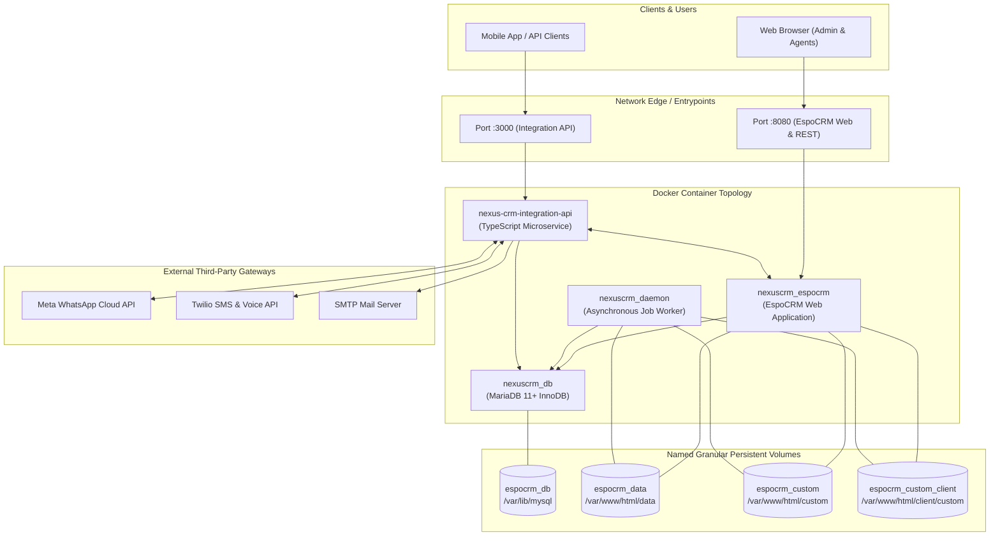
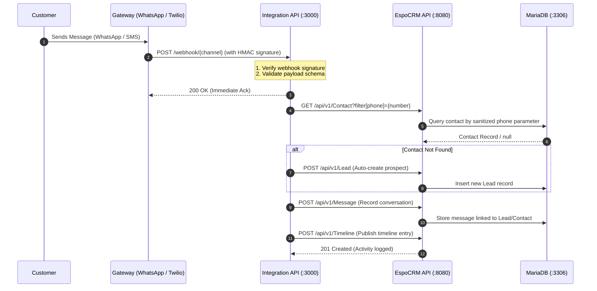

# NexusCRM System Architecture

This document provides a comprehensive technical overview of the **NexusCRM** architecture, detailing container topology, component responsibilities, network data flows, persistent storage models, and security boundaries.

---

## 1. High-Level Architecture Overview

NexusCRM is an enterprise-ready, modular Customer Relationship Management solution designed for high availability, low latency, and secure omnichannel communication. It separates core CRM entity lifecycle management from high-throughput third-party integration pipelines.

---

## 2. Core Components

### 2.1 EspoCRM Core Web Application (`nexuscrm_espocrm`)
- **Image**: `espocrm/espocrm:latest`
- **Role**: Serves the responsive single-page application (SPA) frontend and provides the core REST API for CRM entity management (Leads, Contacts, Accounts, Opportunities, Tasks, Activities).
- **Runtime**: PHP 8.x running under Apache with opcode caching enabled.
- **Port**: Exposed to host on `8080:80`.
- **Health Dependency**: Awaits `espocrm-db` in healthy status before boot.

### 2.2 MariaDB Relational Database (`nexuscrm_db`)
- **Image**: `mariadb:latest`
- **Role**: Primary ACID-compliant persistent relational store.
- **Storage Engine**: InnoDB with utf8mb4 collation.
- **Healthcheck**: Uses native `healthcheck.sh --connect --innodb_initialized` every 20s with 10s start period to ensure zero-downtime container sequencing.
- **Port**: Default internal port `3306` (isolated within the Docker bridge network; not exposed directly to the public internet).

### 2.3 EspoCRM Daemon Worker (`nexuscrm_daemon`)
- **Image**: `espocrm/espocrm:latest` with entrypoint `docker-daemon.sh`
- **Role**: Continuously processes background jobs, workflow triggers, notification dispatch, scheduled emails, and CRM maintenance routines without degrading web request performance.
- **Dependencies**: Depends on the primary `espocrm` container.

### 2.4 Integration API (`nexus-crm-integration-api`)
- **Technology**: Node.js & TypeScript with Express framework.
- **Directory**: `integration-api/`
- **Role**: Bridges external communication networks with the CRM. Features dedicated modules:
  - `src/whatsapp/`: Inbound/outbound webhook handlers for Meta WhatsApp Cloud API.
  - `src/twilio/`: SMS notifications, incoming message processing, voice webhooks.
  - `src/email/`: Transactional email delivery and inbound parse handlers.
  - `src/timeline/`: Aggregates cross-channel conversations into unified timeline activities.
  - `src/espocrm/`: Authenticated REST client communicating with EspoCRM via API keys.
  - `src/config/`: Zero-trust environment configuration loader using `process.env`.
  - `src/storage/`: Document and multimedia attachment handler.

---

## 3. Data & Communication Flows

### 3.1 Inbound Omnichannel Message Flow
The diagram below illustrates how an inbound customer message from WhatsApp or Twilio is securely ingested and linked to CRM entities:

### 3.2 Outbound Agent Communication Flow
When an agent replies from the CRM interface:
1. An EspoCRM webhook or API trigger notifies the `Integration API` with the target recipient and content.
2. The Integration API validates agent permissions and ensures recipient consent.
3. The message is queued and dispatched to the corresponding provider gateway (Twilio, WhatsApp, or SMTP).
4. Status callbacks (Delivered, Read, Failed) are received asynchronously and recorded in the CRM timeline.

---

## 4. Volume Architecture & Persistence

NexusCRM strictly utilizes named Docker volumes to ensure high I/O throughput and persistence across container redeployments:

| Volume Name | Container Path | Purpose |
| :--- | :--- | :--- |
| `espocrm_db` | `/var/lib/mysql` | MariaDB relational database files and InnoDB logs |
| `espocrm_data` | `/var/www/html/data` | Configuration files, file uploads, and session caches |
| `espocrm_custom` | `/var/www/html/custom` | Backend PHP extensions, custom entities, and metadata |
| `espocrm_custom_client` | `/var/www/html/client/custom` | Client frontend customizations, custom views, and assets |

---

## 5. Security & Isolation Architecture

1. **Network Boundary**: The database container (`nexuscrm_db`) is not mapped to any host port in `docker-compose.yml`, restricting access solely to sibling containers on the internal bridge network.
2. **Secrets Decoupling**: Passwords and secrets are injected via `.env` variables into `process.env` and container environment blocks. Zero hardcoded secrets exist in the codebase.
3. **Authorization Layer**: Every endpoint across EspoCRM and the Integration API enforces Role-Based Access Control (RBAC) and Broken Object Level Authorization (BOLA) verification before querying data.
