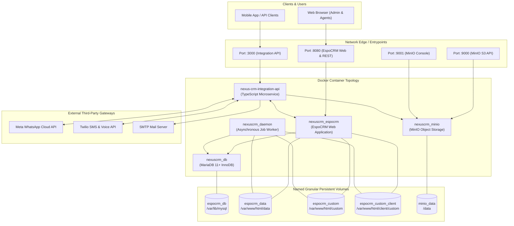
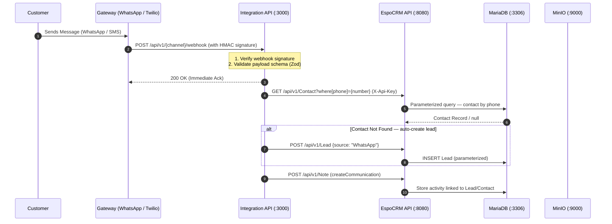
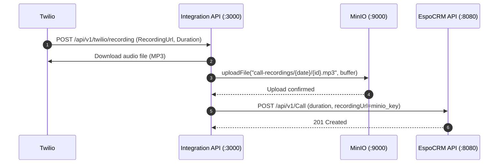

# NexusCRM System Architecture

This document provides a comprehensive technical overview of the **NexusCRM** architecture, detailing container topology, component responsibilities, network data flows, persistent storage models, and security boundaries.

---

## 1. High-Level Architecture Overview

NexusCRM is an enterprise-ready, modular Customer Relationship Management solution designed for high availability, low latency, and secure omnichannel communication. It cleanly separates core CRM entity lifecycle management from high-throughput third-party integration pipelines, and object storage from relational data.

---

## 2. Core Components

### 2.1 EspoCRM Core Web Application (`nexuscrm_espocrm`)
- **Image**: `espocrm/espocrm:latest`
- **Role**: Serves the responsive single-page application (SPA) frontend and provides the core REST API for CRM entity management (Leads, Contacts, Accounts, Opportunities, Tasks, Activities).
- **Runtime**: PHP 8.x running under Apache with opcode caching enabled.
- **Port**: Exposed to host on `8080:80`.
- **Health Dependency**: Awaits `espocrm-db` in healthy status before boot.

### 2.2 MariaDB Relational Database (`nexuscrm_db`)
- **Image**: `mariadb:latest`
- **Role**: Primary ACID-compliant persistent relational store for all CRM entities.
- **Storage Engine**: InnoDB with utf8mb4 collation.
- **Healthcheck**: Uses native `healthcheck.sh --connect --innodb_initialized` every 20s with 10s start period to ensure zero-downtime container sequencing.
- **Port**: Internal only (port `3306` isolated within the Docker bridge network; never exposed to the public internet).

### 2.3 EspoCRM Daemon Worker (`nexuscrm_daemon`)
- **Image**: `espocrm/espocrm:latest` with entrypoint `docker-daemon.sh`
- **Role**: Continuously processes background jobs, workflow triggers, notification dispatch, scheduled emails, and CRM maintenance routines without degrading web request performance.
- **Dependencies**: Depends on the primary `espocrm` container.

### 2.4 MinIO Object Storage (`nexuscrm_minio`)
- **Image**: `cgr.dev/chainguard/minio:latest`
- **Role**: S3-compatible binary object store for call recordings, file attachments, and customer documents. Accessed by the Integration API via AWS SDK v3 (`@aws-sdk/client-s3`) with path-style addressing.
- **Ports**: `9000:9000` (S3 API), `9001:9001` (Web Console).
- **Bucket**: `crm-files` with logical prefixes: `attachments/`, `call-recordings/`, `documents/`.
- **Volume**: `minio_data` persistent named Docker volume.
- **Credentials**: Sourced exclusively from `.env` (`MINIO_ROOT_USER`, `MINIO_ROOT_PASSWORD`).

### 2.5 Integration API (`nexus-crm-integration-api`)
- **Technology**: Node.js 20+ & TypeScript 7.x with Express 5 framework.
- **Port**: `3000:3000`
- **Directory**: `integration-api/`
- **Authentication**: Authenticates to EspoCRM via a dedicated least-privilege API user (`nexus-integration`) using the `X-Api-Key` header. API key stored in `.env` as `ESPOCRM_API_KEY`.
- **Modules**:
  - `src/config/env.ts` — Zod-validated runtime environment configuration; fails fast on missing secrets.
  - `src/whatsapp/` — Meta webhook GET verification + POST inbound message ingestion with payload parsing.
  - `src/twilio/` — Twilio SMS/Voice webhook listeners and outbound SMS dispatcher.
  - `src/email/` — Transactional SMTP email dispatcher.
  - `src/timeline/` — Normalized cross-channel `TimelineEvent` model (`WHATSAPP`, `SMS`, `CALL`, `EMAIL`).
  - `src/espocrm/client.ts` — Axios REST client with entity helpers: `findContactByPhone`, `findContactByEmail`, `findLeadByPhone`, `createLead`, `createCall`, `createMessage`, `createCommunication`, `createAttachment`.
  - `src/storage/minio.ts` — S3Client with `uploadFile`, `getFile`, `checkStorageHealth`.
  - `src/server.ts` — Express app with CORS, JSON+urlencoded parsers, `/health` endpoint, global error handler.

---

## 3. Data & Communication Flows

### 3.1 Inbound Omnichannel Message Flow

### 3.2 Call Recording Storage Flow

### 3.3 Outbound Agent Communication Flow
When an agent replies from the CRM interface:
1. An EspoCRM webhook or API trigger notifies the Integration API with the target recipient and content.
2. The Integration API validates agent permissions and ensures recipient consent.
3. The message is dispatched to the corresponding provider gateway (Twilio, WhatsApp, or SMTP).
4. Status callbacks (Delivered, Read, Failed) are received asynchronously and recorded via `createCommunication()`.

---

## 4. Volume Architecture & Persistence

| Volume Name | Container Path | Purpose |
| :--- | :--- | :--- |
| `espocrm_db` | `/var/lib/mysql` | MariaDB relational database files and InnoDB logs |
| `espocrm_data` | `/var/www/html/data` | Configuration files, file uploads, and session caches |
| `espocrm_custom` | `/var/www/html/custom` | Backend PHP extensions, custom entities, and metadata |
| `espocrm_custom_client` | `/var/www/html/client/custom` | Client frontend customizations, custom views, and assets |
| `minio_data` | `/data` | MinIO binary object storage (call recordings, attachments, documents) |

---

## 5. Security & Isolation Architecture

1. **Network Boundary**: The database container (`nexuscrm_db`) is never mapped to a host port, restricting access solely to sibling containers on the internal bridge network.
2. **Secrets Decoupling**: Passwords and secrets are injected via `.env` → Docker Compose `environment:` blocks and `process.env`. Zod validates all variables at Integration API startup.
3. **Least-Privilege API Access**: The Integration API authenticates to EspoCRM using a dedicated `nexus-integration` API user scoped only to the entities it needs (Contact, Account, Lead, Opportunity, Call, Email, Note, Attachment).
4. **Authorization Layer**: Every endpoint across EspoCRM and the Integration API enforces Role-Based Access Control (RBAC) and Broken Object Level Authorization (BOLA) verification before querying data.
5. **Webhook Signature Verification**: WhatsApp HMAC-SHA256 (`X-Hub-Signature-256`) and Twilio request signatures are verified before any payload processing begins.
