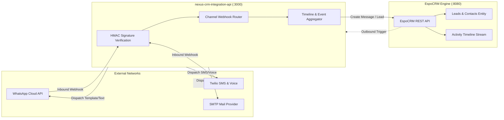

# NexusCRM Third-Party Integrations Guide

This document details the configuration, webhook lifecycle, payload schemas, and security mechanisms for connecting external omnichannel services to **NexusCRM** via the `nexus-crm-integration-api` service.

---

## 1. Integrations Architecture

The `integration-api` microservice acts as an intelligent communication gateway between external third-party communication networks and EspoCRM:



---

## 2. Meta WhatsApp Cloud API Integration

NexusCRM connects directly to the official Meta Graph API (WhatsApp Cloud API) for enterprise messaging.

### 2.1 Required Environment Variables
```bash
WHATSAPP_API_KEY=EAA...
WHATSAPP_PHONE_NUMBER_ID=100000000000000
WHATSAPP_VERIFY_TOKEN=your_secure_random_verification_token
WHATSAPP_APP_SECRET=your_facebook_app_secret
```

### 2.2 Webhook Verification & Processing
Meta requires an initial verification handshake via `GET`:
```typescript
// GET /webhook/whatsapp
app.get('/webhook/whatsapp', (req, res) => {
  const mode = req.query['hub.mode'];
  const token = req.query['hub.verify_token'];
  const challenge = req.query['hub.challenge'];

  if (mode === 'subscribe' && token === process.env.WHATSAPP_VERIFY_TOKEN) {
    return res.status(200).send(challenge);
  }
  return res.sendStatus(403);
});
```

### 2.3 Webhook HMAC Security Verification
Every inbound `POST /webhook/whatsapp` request includes an `X-Hub-Signature-256` header. The integration service validates this header using HMAC SHA-256 against `WHATSAPP_APP_SECRET` before parsing the body:
```typescript
function verifyWhatsAppSignature(req: Request): boolean {
  const signature = req.headers['x-hub-signature-256'] as string;
  if (!signature) return false;

  const expectedHash = 'sha256=' + crypto
    .createHmac('sha256', process.env.WHATSAPP_APP_SECRET!)
    .update((req as any).rawBody)
    .digest('hex');

  return crypto.timingSafeEqual(Buffer.from(signature), Buffer.from(expectedHash));
}
```

### 2.4 Automatic Lead Matching Algorithm
When an incoming message arrives:
1. Extract the sender's E.164 phone number (`from: "15551234567"`).
2. Query EspoCRM via `GET /api/v1/Contact?filter[phone]=15551234567`.
3. If no matching Contact exists, query `GET /api/v1/Lead?filter[phone]=15551234567`.
4. If neither exists, automatically issue `POST /api/v1/Lead` with:
   - `phoneNumber`: `+15551234567`
   - `source`: `"WhatsApp"`
   - `status`: `"New"`
5. Post the message content to the Contact/Lead Activity Stream.

---

## 3. Twilio SMS & Voice Integration

NexusCRM leverages Twilio for global SMS messaging and telephony tracking.

### 3.1 Required Environment Variables
```bash
TWILIO_ACCOUNT_SID=ACXXXXXXXXXXXXXXXXXXXXXXXXXXXXXXXX
TWILIO_AUTH_TOKEN=your_twilio_auth_token
TWILIO_PHONE_NUMBER=+1234567890
```

### 3.2 Inbound SMS Webhook
- **Endpoint**: `POST /webhook/twilio/sms`
- **Security**: Validates `X-Twilio-Signature` using `twilio.validateRequest`.
- **Response**: Emits empty `<Response/>` TwiML to complete acknowledgement.

### 3.3 Outbound SMS Dispatch Example
```typescript
import twilio from 'twilio';

const client = twilio(process.env.TWILIO_ACCOUNT_SID, process.env.TWILIO_AUTH_TOKEN);

export async function sendSms(to: string, messageBody: string): Promise<string> {
  const response = await client.messages.create({
    from: process.env.TWILIO_PHONE_NUMBER,
    to: to,
    body: messageBody,
  });
  return response.sid;
}
```

### 3.4 Twilio Voice Webhooks
- **Endpoint**: `POST /webhook/twilio/voice`
- **Behavior**: Returns TwiML dial instructions to route incoming calls to available agents, initiates call duration tracking, and uploads recording URLs directly into the EspoCRM call history entity.

---

## 4. SMTP Email Integration

NexusCRM supports transactional and notification email delivery through any standard SMTP server (SendGrid, Mailgun, AWS SES, or internal Postfix).

### 4.1 Required Environment Variables
```bash
SMTP_HOST=smtp.mailgun.org
SMTP_PORT=587
SMTP_USER=postmaster@example.com
SMTP_PASS=your_smtp_password
SMTP_FROM="NexusCRM Support" <support@example.com>
```

### 4.2 Security & XSS Prevention
- All outgoing email templates are rendered server-side.
- Inbound email content displayed in the CRM UI is thoroughly sanitized using HTML sanitizers (stripping malicious `<script>` tags, inline event handlers, and data URLs) to eliminate stored Cross-Site Scripting (XSS).

---

## 5. MinIO S3 Object Storage Integration

NexusCRM integrates with MinIO for S3-compatible cloud object storage to securely manage attachments, media files, call recordings, and lead documents.

### 5.1 Required Environment Variables
```bash
MINIO_ENDPOINT=localhost
MINIO_PORT=9000
MINIO_USE_SSL=false
MINIO_ROOT_USER=minioadmin
MINIO_ROOT_PASSWORD=your_strong_minio_password
MINIO_BUCKET=crm-files
```

### 5.2 Implementation Pattern (`src/storage/minio.ts`)
The integration uses AWS SDK v3 (`@aws-sdk/client-s3`, `@aws-sdk/s3-request-presigner`):
- **Bucket Auto-Initialization**: Ensures the target bucket (default `crm-files`) exists on microservice startup.
- **Upload File**: Streams buffers or file payloads with explicit content types and unique UUID object keys.
- **Get File & Streaming**: Downloads object streams with zero data leakage.
- **Presigned URLs**: Generates time-limited download URLs (default 1 hour expiry) for secure agent media access.
- **Health Check**: Ping bucket existence verification integrated into `GET /health`.

---

## 6. EspoCRM REST Client Integration (`src/espocrm/client.ts`)

The Integration API communicates with EspoCRM using dedicated API Key authentication (`X-Api-Key` header) provisioned for the `nexus-integration` API user.

### 6.1 Authentication & Configuration
```bash
ESPOCRM_API_URL=http://localhost:8080/api/v1
ESPOCRM_API_KEY=48df62e9a00799ea4ed5f1d03d774aee
```

### 6.2 Capabilities
- **Generic CRUD**: `getEntity<T>()`, `createEntity<T>()`, `updateEntity<T>()`, `deleteEntity()`, `searchEntities<T>()`.
- **Omnichannel Communication Records**: `createCommunication()` creating normalized communication entities linked to Leads or Contacts.
- **Contact & Lead Lookup**: `findContactByPhone()`, `findContactByEmail()`, `findLeadByPhone()`, `findLeadByEmail()`.
- **Stream Activity Posting**: `postTimelineNote()` posts rich message snippets into entity activity streams.
- **Health Status**: `checkHealth()` executes quick status probe against EspoCRM App Info endpoint.

---

## 7. Unified Activity Timeline Stream

To provide support agents with complete context, conversations from WhatsApp, Twilio SMS, Voice calls, and Emails are indexed into a unified timeline:

```json
{
  "entityType": "Lead",
  "entityId": "65b91a784d092",
  "channel": "WhatsApp",
  "direction": "Inbound",
  "timestamp": "2026-10-07T14:30:00Z",
  "sender": "+15551234567",
  "content": "Hello, I am interested in scheduling a product demonstration.",
  "status": "Received"
}
```

Agents can view the entire multi-channel dialogue history in one consolidated chronological thread inside EspoCRM.

