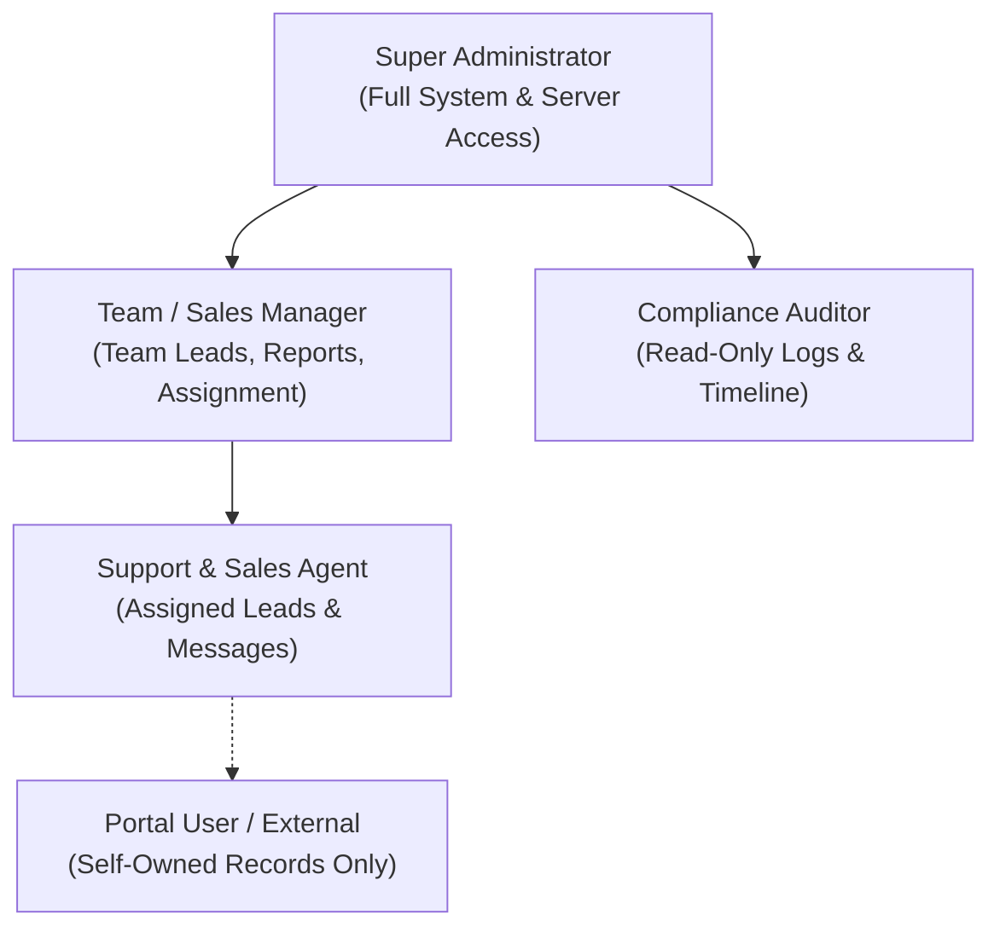

# Role-Based Access Control (RBAC) & BOLA Defense

This document specifies the authorization framework, role hierarchy, permission matrices, and **Broken Object Level Authorization (BOLA)** defense mechanisms implemented across **NexusCRM**.

---

## 1. Security Architecture Principles

1. **Zero Client Trust**: All authorization checks are computed strictly server-side. Frontend UI controls (hiding a button or masking an element) are convenience features only; the backend verifies authorization for every HTTP request.
2. **Defensive BOLA Enforcement**: Every API endpoint handling entity IDs (e.g., `/api/v1/leads/:id`, `/api/v1/messages/:id`) validates that the authenticated principal possesses legitimate ownership or team-level authorization to operate on that specific record.
3. **PII Protection**: Sensitive Personally Identifiable Information (such as customer or student phone numbers, email addresses, billing details, and personal notes) is never exposed on unauthenticated or public endpoints.
4. **Secure Session Isolation**: User authentication relies on cryptographically signed HTTP-only cookies (`HttpOnly`, `Secure`, `SameSite=Strict`), safeguarding against token theft via Cross-Site Scripting (XSS).

---

## 2. Role Hierarchy & Responsibilities



### 2.1 Role Descriptions
- **Super Administrator (`super_admin`)**: Manages system settings, database credentials, API integrations (WhatsApp, Twilio, SMTP), role assignments, and audit logs.
- **Sales / Support Manager (`manager`)**: Manages team queues, assigns leads, reviews agent performance metrics, and accesses records belonging to all team members.
- **Support & Sales Agent (`agent`)**: Interacts directly with leads and customers. Permitted only to view, edit, and message contacts assigned directly to them or their immediate queue.
- **Compliance Auditor (`auditor`)**: Read-only oversight across all communications, audit logs, and timeline events for compliance verification. Cannot modify or delete records.
- **Portal User (`portal_user`)**: Restricted external end-user account limited strictly to their own support tickets and communication threads.
- **Integration API (`nexus-integration` Service Role)**: Programmatic service account authenticating via `X-Api-Key`. Possesses scoped CRUD permissions for Lead, Contact, Account, Call, Email, Meeting, and Communication entities required for omnichannel ingestion and synchronization, without interactive UI login rights.

---

## 3. Granular Permissions Matrix

| Entity / Resource | Action | Super Admin | Manager | Agent | Auditor | Portal User |
| :--- | :--- | :---: | :---: | :---: | :---: | :---: |
| **Leads & Contacts** | View / Read | All | Team | Assigned Only | All | Forbidden |
| **Leads & Contacts** | Create | Yes | Yes | Yes | No | Forbidden |
| **Leads & Contacts** | Edit / Update | All | Team | Assigned Only | No | Forbidden |
| **Leads & Contacts** | Delete | Yes | Team Only | No | No | Forbidden |
| **Messages (WA/SMS/Email)** | View Content | All | Team | Assigned Only | All | Own Only |
| **Messages (WA/SMS/Email)** | Send / Dispatch | Yes | Yes | Assigned Only | No | Own Only |
| **Timeline Activity** | View Stream | All | Team | Assigned Only | All | Own Only |
| **Integration Settings** | Configure APIs | Yes | No | No | No | Forbidden |
| **Audit & Access Logs** | View Logs | Yes | Team | No | All | Forbidden |

---

## 4. Broken Object Level Authorization (BOLA / IDOR) Defense

### 4.1 Threat Overview
Broken Object Level Authorization occurs when an attacker manipulates the ID of an object in a request (e.g., changing `GET /api/v1/leads/4501` to `GET /api/v1/leads/4502`) to access records belonging to another agent or customer.

### 4.2 Backend Enforcement Middleware Pattern

In the `integration-api` service, all resource access is guarded by an object-level authorization policy:

```typescript
import { Request, Response, NextFunction } from 'express';
import { db } from '../storage/db';

export async function authorizeLeadAccess(
  req: Request,
  res: Response,
  next: NextFunction
) {
  const user = req.user; // Injected by authenticateSession middleware
  const leadId = req.params.id;

  if (!user) {
    return res.status(401).json({ error: 'Authentication required' });
  }

  // 1. Super Admins bypass object ownership restrictions
  if (user.role === 'super_admin') {
    return next();
  }

  // 2. Fetch record using strictly parameterized query
  const query = 'SELECT id, assigned_user_id, team_id FROM leads WHERE id = ? LIMIT 1';
  const [rows] = await db.execute(query, [leadId]);

  if (!rows || rows.length === 0) {
    return res.status(404).json({ error: 'Record not found' });
  }

  const lead = rows[0];

  // 3. Manager verification: Check team membership
  if (user.role === 'manager' && user.teamIds.includes(lead.team_id)) {
    return next();
  }

  // 4. Agent verification: Check direct assignment
  if (user.role === 'agent' && lead.assigned_user_id === user.id) {
    return next();
  }

  // 5. Unauthorized access attempt detected
  console.warn(`[SECURITY ALERT] BOLA violation attempt: User ${user.id} requested Lead ${leadId}`);
  return res.status(403).json({ error: 'Access forbidden: You do not own this resource' });
}
```

---

## 5. Authentication & Session Cookie Hardening

### 5.1 Cookie Configuration
Session cookies are issued with hardened attributes:
```typescript
res.cookie('nexus_session', sessionId, {
  httpOnly: true,                    // Prevents JavaScript access (XSS mitigation)
  secure: process.env.NODE_ENV === 'production', // HTTPS only in production
  sameSite: 'strict',                // Prevents Cross-Site Request Forgery (CSRF)
  maxAge: 8 * 60 * 60 * 1000,        // 8 hours lifespan
  path: '/',
});
```

### 5.2 Session Invalidation
- Sessions are immediately revoked upon explicit logout.
- Privilege changes (e.g., an agent promoted to manager) trigger automatic session termination and forced re-authentication to prevent privilege token desynchronization.
